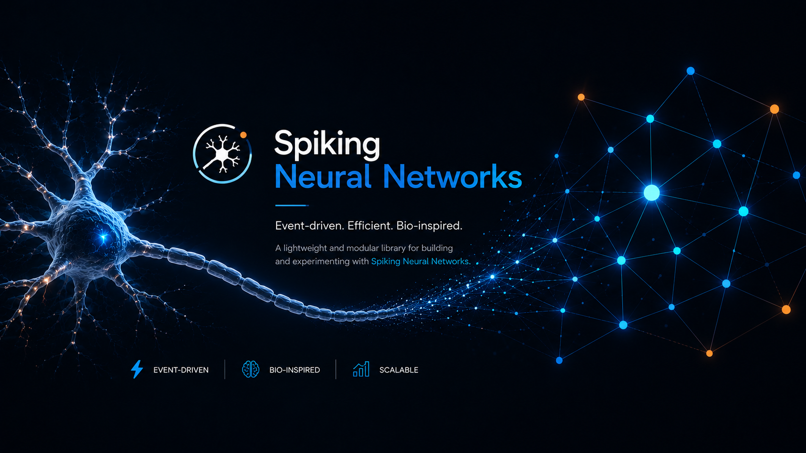
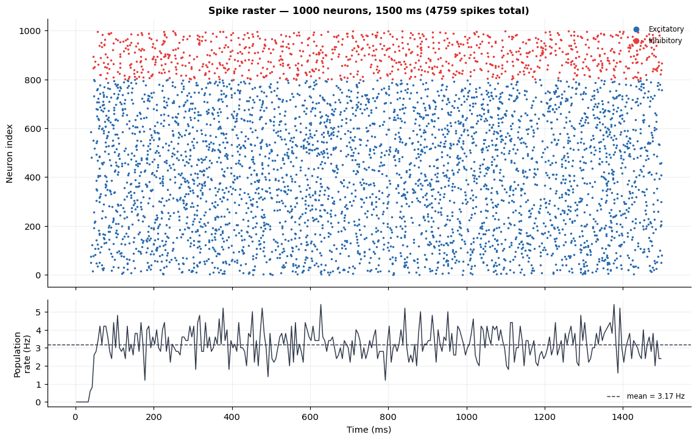

# Neuro-AI-Foundations

<p align="center">
      
</p>

---

### 📌 The Evolutionary Path

Each model is derived directly from its governing differential equation, with complexity added incrementally to bridge the gap between biological realism and computational efficiency:

| Step | Model | Key Feature | Spike Behaviour |
|:---:|:---|:---|:---|
| 1 | Passive Membrane | RC Circuit | None |
| 2 | Leaky I&F (LIF) | Hard Threshold | Fixed threshold spike |
| 3 | Exponential I&F (EIF) | Exponential nonlinearity | Biophysical onset |
| 4 | AdEx | Adaptation current | Bursting & adaptation |
| 5 | Balanced Network | Sparse connectivity | Irregular, asynchronous firing |


### Neuro-AI Foundations Study Guide

For an in-depth analysis of the mathematical derivations, parameter dynamics, and biological intuition behind these models, please refer to the following guides:

*  📘 [English Study Guide (PDF)](./doc/Neuro-AI-Foundations-Study-Guide.pdf)
*  📘 [Persian Study Guide (PDF)](./doc/Persian.pdf)

  
### Engineering Highlights

Designed with production-grade standards to ensure accuracy and scalability:

*   **Vectorized Implementation:** Core dynamics are built with NumPy, optimized for efficient matrix calculations and high-performance simulation.
*   **Modular Architecture:** Utilizes Abstract Base Classes (ABCs) to define extensible, reusable neuron dynamics.
*   **Test-Driven Design:** Includes a comprehensive suite of unit tests to validate numerical accuracy and system stability across all models.
*   **Reproducibility:** Every model is accompanied by detailed Jupyter notebooks, documenting the mathematical derivation and visualizing the resulting dynamics.

### Project Objective
The goal of `Neuro-AI-Foundations` is to provide a clean, rigorous software foundation for spiking neural simulations. It enables researchers and engineers to focus on mathematical analysis and emergent network behaviors, rather than implementation overhead.

---

## 📓 Notebooks

| Notebook | What it covers |
|---|---|
| [`01_Passive_and_LIF.ipynb`](notebooks/01_Passive_and_LIF.ipynb) | Builds the passive membrane and LIF neuron, derives the F-I curve, shows how the refractory period caps it, and validates Euler against RK4 for LIF's linear dynamics. Ends by driving a LIF neuron with a realistic Poisson-filtered synaptic current instead of a step. |
| [`02_Non_Linear_Integrate_and_Fire.ipynb`](notebooks/02_Non_Linear_Integrate_and_Fire.ipynb) | Introduces the exponential (EIF) nonlinearity, compares it directly against LIF's hard threshold (voltage trajectories, rheobase, F-I curves, spike latency), and revisits Euler vs. RK4 — this time for genuinely nonlinear dynamics, where the choice of integrator actually matters. |
| [`03_The_Need_for_Adaptation_AdEx.ipynb`](notebooks/03_The_Need_for_Adaptation_AdEx.ipynb) | Switches on the AdEx adaptation current `w`, visualizes spike-frequency adaptation directly (instantaneous vs. steady-state F-I curves), and shows a gallery of four qualitatively different firing patterns from the same two equations. |
| [`04_Phase_Plane_Analysis.ipynb`](notebooks/04_Phase_Plane_Analysis.ipynb) | Explains *why* those firing patterns emerge, geometrically, via the `(v, w)` phase plane and its nullclines/fixed points. Includes a live `ipywidgets` explorer — drag `a`, `b`, `τ_w`, `v_reset`, and `I` and watch the nullclines and firing pattern shift in real time. |
| [`05_Balanced_Recurrent_Network.ipynb`](notebooks/05_Balanced_Recurrent_Network.ipynb) | Scales up to a 1000-neuron recurrent LIF network with Dale's law and Poisson background drive, and demonstrates the Asynchronous-Irregular (AI) regime with raster plots, population rate, ISI-CV statistics, and a direct empirical test of the excitation/inhibition balance mechanism. |

---

## 🛠️ Installation

**1. Clone the repository:**
```bash
git clone https://github.com/alitkbbl/Neuro-AI-Foundations.git
cd Neuro-AI-Foundations
```

**2. Set up a virtual environment (Recommended):**
Using an isolated environment ensures dependency versions do not conflict with your other projects.

```bash
python3 -m venv .venv

# Activate on Linux / macOS:
source .venv/bin/activate

# Activate on Windows:
.venv\Scripts\activate
```

**3. Install dependencies:**
```bash
python -m pip install --upgrade pip

# Install the required packages
pip install -r requirements.txt
```

**4. Register the Jupyter Kernel and Launch:**
To ensure Jupyter runs within the correct environment and interactive widgets work properly, register the local kernel before launching:

```bash
python -m ipykernel install --user --name=neuroai --display-name "Python (Neuro-AI)"
jupyter notebook notebooks/01_Passive_and_LIF.ipynb
```

Run the test suite:

```bash
pytest tests/ -v
```

---

## ⚙️ Models Overview & Mathematical Foundations

This repository implements several foundational models in computational neuroscience. Below is a unified overview of their key features alongside their mathematical formulations.

### 1. Leaky Integrate-and-Fire (LIF) / Passive Membrane
The LIF model is the simplest spiking neuron model, treating the cell membrane as an RC circuit (resistor-capacitor). It is computationally highly efficient but lacks spike-frequency adaptation.

*   **Key Features:** Linear subthreshold dynamics, fixed spike threshold, computationally cheap.
*   **Subthreshold Equation:**
    $$\tau_m \frac{dv}{dt} = -(v - E_L) + R\,I(t)$$
    *Where $\tau_m$ is the membrane time constant, $E_L$ is the leak reversal potential (resting potential), $R$ is membrane resistance, and $I(t)$ is the input current.*
*   **Spiking Mechanism:** When $v \ge v_{th}$, a spike is emitted, and the voltage is reset to $v_{reset}$.

### 2. Adaptive Exponential Integrate-and-Fire (AdEx)
The AdEx model extends the LIF model by adding an exponential voltage dependence for spike generation and a second variable for adaptation. It can reproduce a wide variety of physiological firing patterns (e.g., bursting, tonic spiking, adaptation).

*   **Key Features:** Realistic spike initiation (exponential), spike-frequency adaptation, subthreshold resonance.
*   **Voltage Dynamics:**
    $$C_m \frac{dv}{dt} = -g_L (v - E_L) + g_L \Delta_T \exp\left(\frac{v - v_T}{\Delta_T}\right) - w + I(t)$$
*   **Adaptation Dynamics:**
    $$\tau_w \frac{dw}{dt} = a(v - E_L) - w + b\,\tau_w \sum_f \delta(t - t^f)$$
    *Where $C_m$ is membrane capacitance, $g_L$ is leak conductance, $\Delta_T$ is the slope factor, $v_T$ is the threshold potential, $w$ is the adaptation current, and $a$ and $b$ govern subthreshold and spike-triggered adaptation, respectively. The Dirac delta function $\delta(t - t^f)$ models the step increase in $w$ at each spike time $t^f$.*

### 3. Balanced Networks (Excitatory-Inhibitory Balance)
Moving from single neurons to network-level dynamics, this repository implements sparsely connected, random networks of E (Excitatory) and I (Inhibitory) neurons.

*   **Key Features:** Asynchronous irregular (AI) firing states, fluctuation-driven spiking, sparse random connectivity.
*   **Network Dynamics:** Neurons in the network (typically modeled as LIF or AdEx) receive a massive number of inputs. The network enters a "balanced state" where large excitatory inward currents are dynamically canceled by large inhibitory outward currents, leaving only fluctuations (noise) to drive action potentials.

---

## 📈 Main results

The primary objective of this project is to show that everything culminates in a **genuinely emergent, network-level phenomenon** — one that no single neuron in the simulation, however sophisticated, produces on its own.

Running the default 1000-neuron network in `05_Balanced_Recurrent_Network.ipynb` (800 excitatory / 200 inhibitory, 10% connection probability, inhibition scaled 5x above excitation) produces:

- A **scattered, non-synchronized raster** — no visible stripes or population-wide bursts — with a population firing rate that fluctuates around a stable mean (~3 Hz here) rather than oscillating or diverging.
- Individually **irregular** spike trains: a mean ISI coefficient of variation around 0.5, well above the near-zero CV of a clock-like or purely mean-driven neuron, though below the CV = 1 of a strictly memoryless Poisson process.
- A direct demonstration that this stability is a **balance** effect, not a weak-input effect: sweeping the inhibitory scaling factor `g` shows the population rate rising with excitatory strength when inhibition is weak, and becoming largely *insensitive* to excitatory strength once inhibition is strong enough to track and cancel it.

That's the payoff of the whole ladder: the neurons doing the work here are the simplest model in the entire project (plain LIF, no adaptation, no nonlinearity) — the richness comes entirely from Dale's law, sparse recurrent connectivity, and the excitation/inhibition balance, at scale.



---

## ⚖️ License
This project is licensed under the MIT License. If you use this code in your research, please use the **"Cite this repository"** widget on the right sidebar to cite this project and refer to the primary literature of the implemented models.
