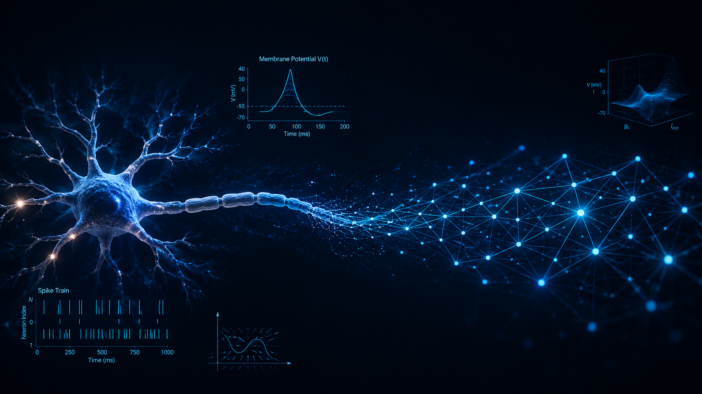

# Neuro-AI-Foundations 🧠💻

## 📌 About The Project
**Neuro-AI-Foundations** is a computational neuroscience framework designed to bridge the gap between biological neuronal dynamics and modern AI implementation techniques. This repository provides a highly optimized, Object-Oriented, and vectorized Python environment for simulating spiking neurons—from simple passive membranes to complex, adaptive networks.

Our core philosophy is to model biological realities using exact coupled differential equations (e.g., $C_m \frac{dV}{dt} = \dots$), solved numerically via Euler integration ($dt \le 0.1ms$), while leveraging NumPy's vectorized operations to scale these simulations to thousands of interconnected neurons efficiently.

## 🚀 Key Features
1. **Biophysical Neuron Models:** 
   - **Passive Neuron:** Baseline membrane dynamics without action potentials.
   - **Leaky Integrate-and-Fire (LIF):** Standard threshold-and-reset spiking dynamics.
   - **Adaptive Exponential Integrate-and-Fire (AdEx):** Complex cortical neuron modeling incorporating an adaptation variable ($w$).
2. **Vectorized Network Architecture:** Simulation of large-scale, recurrent networks (e.g., Balanced Networks in Asynchronous-Irregular regimes) using sparse matrix operations ($W \cdot \vec{S}$).
3. **Interactive Analytical Notebooks:** Programmatically generated Jupyter notebooks for Phase Plane Analysis and F-I (Frequency-Current) curve evaluations.

## 🛠️ Stack & Architecture
- **Language:** Python 3.x
- **Core Libraries:** `numpy` (Vectorized Math), `scipy` (Scientific computing)
- **Analysis & Visualization:** `matplotlib`, `jupyter`, `ipywidgets`
